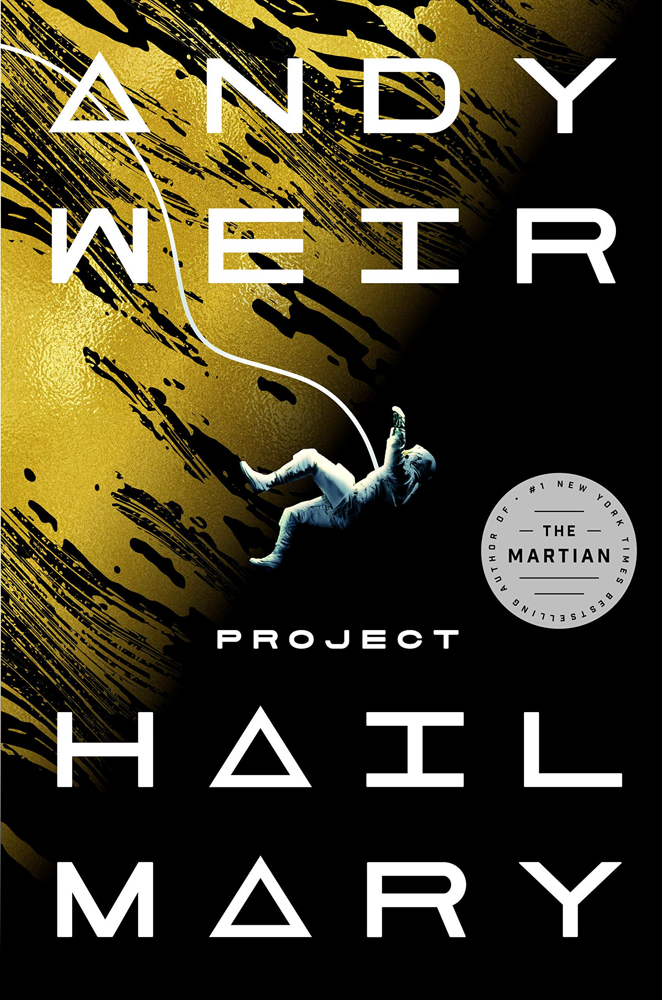

# Project Hail Mary

## Description

### **PLEASE NOTE THAT THE FOLLOWING DOCUMENTS MAY CONTAIN INFORMATION FROM THE ENTIRE DURATION OF THE  PROJECT HAIL MARY MISSION. READERS SHOULD BE ADVISED THAT SHOULD THEY CONTINUE, THEY MAY LEARN INFORMATION RELATED TO THE MISSION OUT OF SEQUENCE FROM THE OFFICIAL DOCUMENTATION BY ANDY WEIR**

This is document containing notes from first contact between the Hail Mary and an unknown Eridian vessel in the Tau Ceti system while investigating the events surrounding the Atrophage's arrival in the Sol System. It is written in english from a human perspective and for human consumption. Please forgive any biases that this human-centric perspective may imply.
It contains a number of helpful programs for understanding the scientific concepts outlined in the book. 
It includes several tools for converting between Eridian and Human units as well as simple references for several of the common mathematical operations used throughout the book.

## Available Tools:

- Eridian Integer to Human Integer Conversion Tool
- Human Integer to Eridian Integer Conversion Tool
- Human/Eridian Atmosphere Conversion tool
- Eridian/Human Time Conversion

## Coming Soon:
- Astrophage Fuel Consumption
- Astrophage Navigation
- Astrophage Detection
